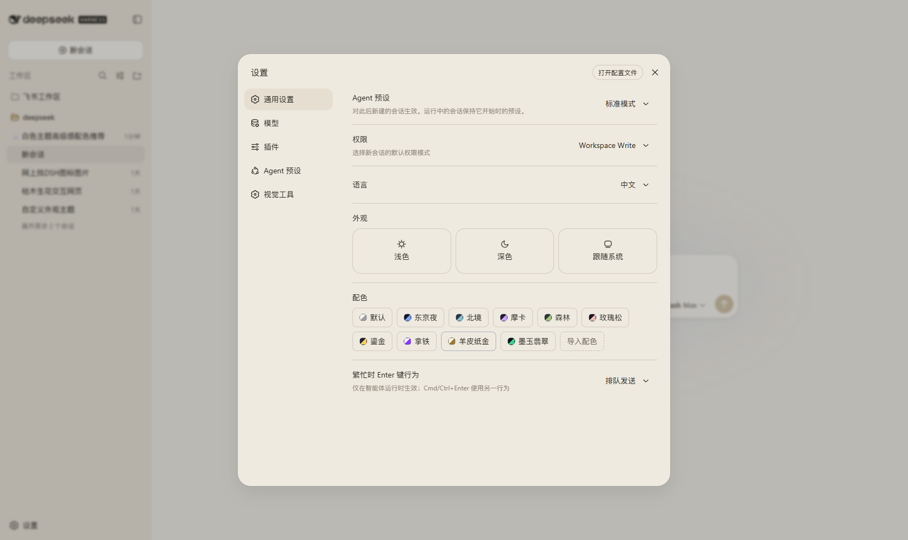
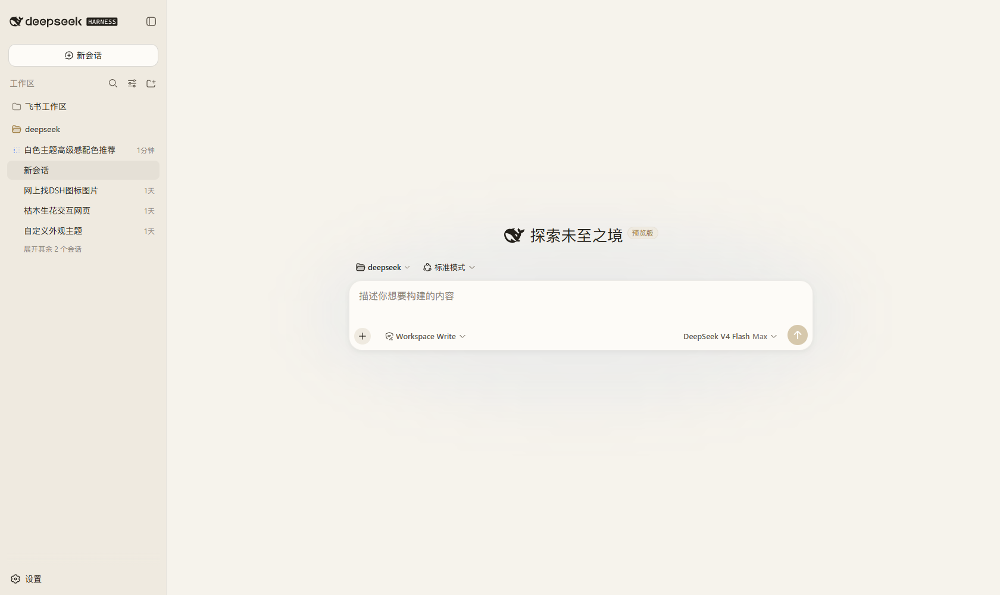
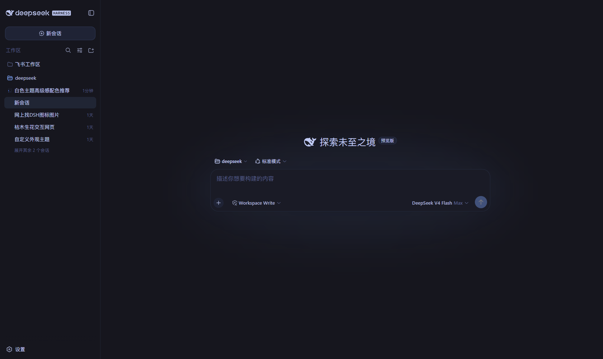
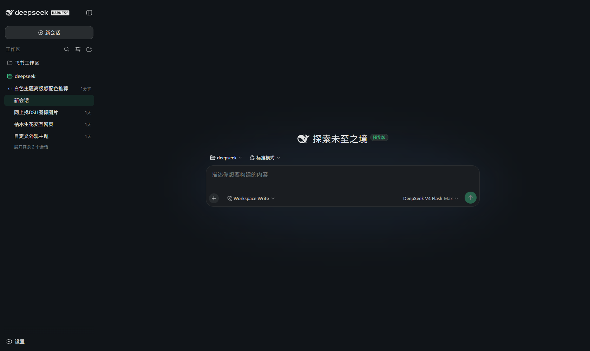
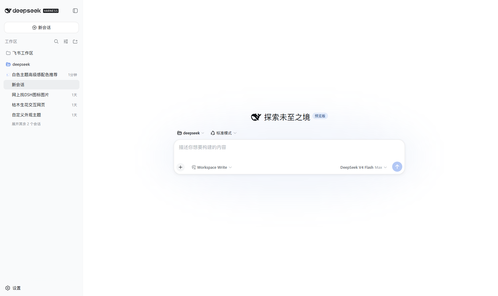

# dsh-premium-themes

[English](README.md) | 中文

dsh Web 界面的独立可热插拔「高级配色」插件 —— 不改动任何核心包,全部基于公开
扩展点。它在设置面板「外观」下方新增一行**配色**,内置 8 套精选方案(东京夜、
北境、摩卡、森林、玫瑰松、鎏金、拿铁、羊皮纸金),并提供**导入配色**对话框,
支持自定义配色。

每套配色(内置或导入)都是完整的第三方主题定义:切换后会整体重绘背景层级、
边框、品牌色、按钮、文字、代码块、侧栏与滚动条。选择跨刷新、跨会话持久化;
点击**默认**回到选配色之前的 浅色/深色/跟随系统 状态。

## 效果预览

设置面板里的「配色」行 —— 8 套内置色块、导入的「墨玉翡翠」色块与「导入配色」按钮:



| 羊皮纸金(浅色) | 东京夜(深色) |
|:---:|:---:|
|  |  |

| 墨玉翡翠 —— 自定义导入(深色) | 默认浅色(基础) |
|:---:|:---:|
|  |  |

## 自定义配色导入

填入**名称**、**明暗**(深/浅)、**底色**与**强调色**,插件用确定性算法
(`src/derive.ts`)从种子色推导完整令牌图 —— 层级表面、边框、按钮、文字阶梯、
代码块、侧栏、滚动条一步到位。可选的高级 JSON 字段接受 `text`/`surface`
种子色与显式 `--dsw-*` 令牌覆盖:

```json
{ "text": "#f2e9dc", "surface": "#20203a", "tokens": { "--dsw-alias-brand-primary": "#ffcc66" } }
```

导入的配色存入插件自己的设置命名空间(机器 id 由名称生成,纯中文名会得到生成
id),以内置配色同款的色块展示、跨刷新持久化,可在对话框内删除(删除当前生效
的会自动回落基础主题)。

## 安装(热插拔)

```bash
# 从本仓库直装(pnpm 会通过 prepare 脚本构建):
dsh plugin web add github:xiaoyanzi191/dsh-premium-themes

# 在 profile 补丁层追加一行 —— $DSH_HOME/profiles/web/cordis.patch.yml:
#
#   - insert:
#       - id: ui-premium-themes
#         name: '@deepseek-ai/dsh-client-ui-premium-themes'
```

保存补丁后组合树实时热重载;刷新一次页面,「配色」行即出现在
设置 → 通用设置 的「外观」下方。要关闭该功能,删掉这一行(或加
`disabled: true`),下次刷新即消失,正在生效的配色回落基础主题。

注意:行级 `inject` 是服务名而非插件 id;浏览器侧加载顺序由包内
`dsh.client.inject` 的图边保证,node 半边只依赖可选的 settings/webServer
服务。

## 开发

```bash
pnpm install
pnpm run build   # tsc -> lib/types,再由 tsdown 产出 lib/index.js + lib/client.js
pnpm test        # vitest:设置、推导、宿主路由(35 个用例)
```

两个客户端接线/UI 套件(`apply.client.spec.ts`、`palette-row.client.spec.tsx`)
导入的是 dsh 客户端包,npm 上以浏览器闭包工厂形式发布 —— 它们在
deepseek-harness 检出内运行(那里 vitest 解析包源码,执行
`pnpm run test:client`)。如需在 monorepo 内开发,把本仓库克隆到
deepseek-harness 检出的 `packages/client/` 下(那里的 workspace 用
`workspace:*` 依赖与上游 `clientBundle` 预设;本仓库的 `tsdown.config.ts`
是那份预设的自包含快照)。

## 结构

```
src/
├── theme-settings.ts   # 唯一数据契约:命名空间、字段、路由、id 规则、schema
├── palettes.ts         # 纯数据:8 套内置配色令牌表
├── derive.ts           # 纯函数:种子色 → 全令牌推导(含颜色数学工具)
├── boot.ts             # 纯函数:选择 → 插件激活前的启动脚本
├── index.ts            # host 半边:设置注册 + palette/custom 双路由
└── client/
    ├── index.ts        # 浏览器半边:主题注册 + 启动采纳 + 导入生命周期
    ├── PaletteRow.tsx / ImportPaletteDialog.tsx / settings-store.ts / locales.ts
```

## 兼容性

基于 npm `next` 标签发布的 dsh 包构建(`^0.1.0-rc.6`)。插件要求组合树中存在
`ui-theme` 插件(它通过其公开的主题运行时注册配色)。
